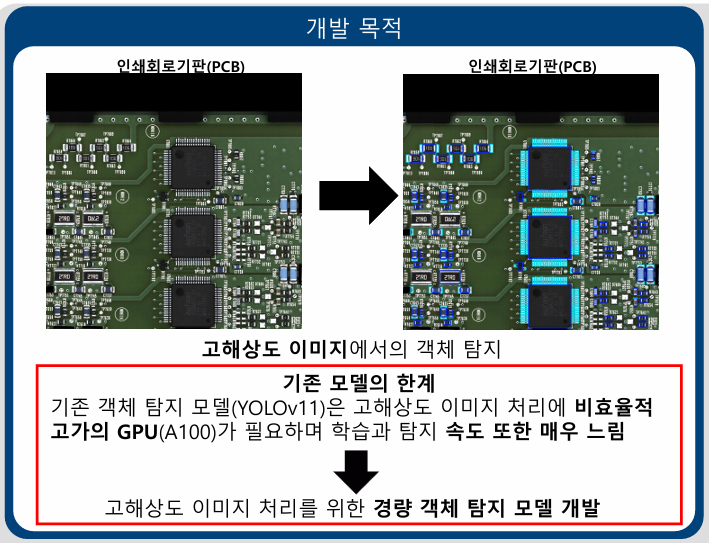
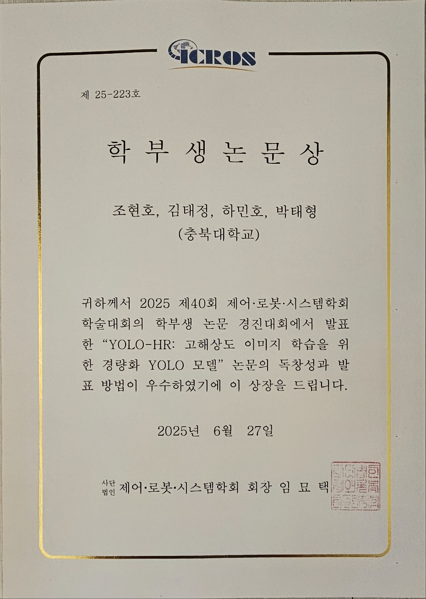
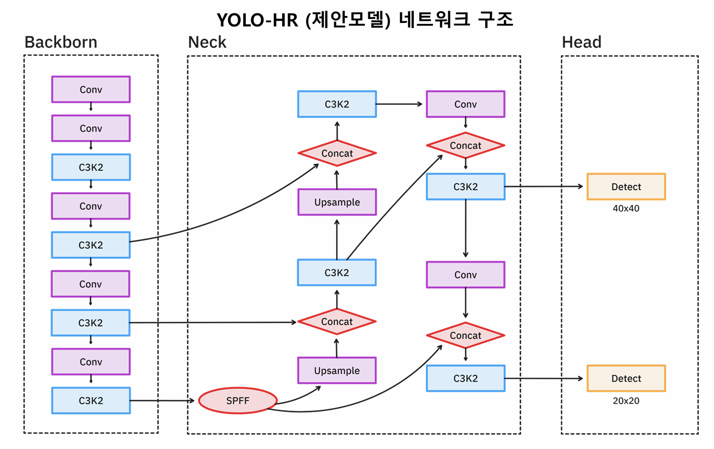
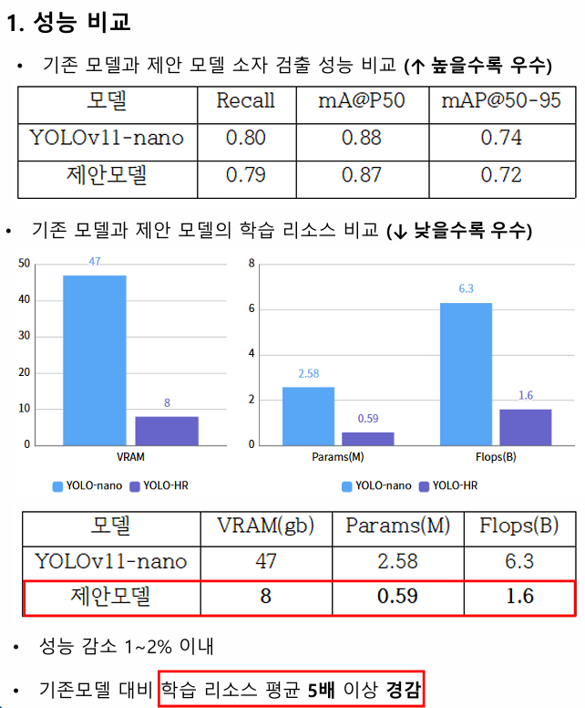

# YOLO-HR: 고해상도 이미지 학습을 위한 경량화 YOLO 모델

이 프로젝트는 기존의 YOLOv11모델을 개선하여 PCB(Printed Circuit Board)와 같은 3904x3904의 고해상도 이미지에서 효율적인 학습 및 추론을 가능하게 하는 모델을 개발하는 프로젝트입니다.

## 프로젝트 목적




## 수상 내역



[논문 바로가기](https://www.dbpia.co.kr/journal/articleDetail?nodeId=NODE12313630&nodeId=NODE12313630&mobileYN=N&medaTypeCode=185005&isPDFSizeAllowed=true&locale=ko&foreignIpYn=N&articleTitle=YOLO-HR%3A+%EA%B3%A0%ED%95%B4%EC%83%81%EB%8F%84+%EC%9D%B4%EB%AF%B8%EC%A7%80+%ED%95%99%EC%8A%B5%EC%9D%84+%EC%9C%84%ED%95%9C+%EA%B2%BD%EB%9F%89%ED%99%94+YOLO+%EB%AA%A8%EB%8D%B8&articleTitleEn=YOLO-HR%3A+A+Lightweight+YOLO+Model+for+High-Resolution+Image+Learning&voisId=VOIS00779160&voisName=2025+%EC%A0%9C40%ED%9A%8C+%EC%A0%9C%EC%96%B4%EB%A1%9C%EB%B4%87%EC%8B%9C%EC%8A%A4%ED%85%9C%ED%95%99%ED%9A%8C+%ED%95%99%EC%88%A0%EB%8C%80%ED%9A%8C&voisCnt=516&searchResultKey=%2FlMfWK6MWZi5N74t6Fqz8TrkPkBxmMx25IqhA%2F8OrriZSvtpEKaedZBtVdoyygEU&language=ko_KR&hasTopBanner=true)


## 모델 구조




## 결과




## 🛠️ 환경 설정

이 프로젝트는 Poetry를 사용하여 의존성을 관리합니다.

### 필수 요구사항
- Python >= 3.12
- CUDA 지원 GPU (학습 시 권장)
- Poetry

### 설치 방법

1. **Poetry 설치** (미설치 시)
   ```bash
   curl -sSL https://install.python-poetry.org | python3 -
   ```

2. **프로젝트 클론 및 의존성 설치**
   ```bash
   git clone <repository-url>
   cd new-yolo
   poetry install
   ```

3. **가상환경 활성화**
   ```bash
   poetry shell
   ```

## 📁 프로젝트 구조

```
new-yolo/
├── main.py                    # 🎓 학습용 스크립트
├── test.py                    # 🔍 추론 및 테스트용 스크립트
├── yolo-pcb_*yaml      # 📐 실험용 모델 구조 정의
├── best.pt                    # 🏆 최고 성능 학습된 모델
├── yolo_dataset2/             # 📂 데이터셋
│   ├── train/images/          # 학습 이미지
│   ├── val/images/            # 검증 이미지
│   ├── test/images/           # 테스트 이미지
│   └── data.yaml              # 데이터셋 설정
├── runs/                      # 📊 학습 결과 및 추론 결과
├── pyproject.toml             # 📦 Poetry 설정
└── README.md                  # 📖 이 파일
```

## 🚀 사용법

### 1. 모델 학습 (`main.py`)

```bash
python main.py
```

**주요 기능:**
- 커스텀 YOLO 모델 구조를 기반으로 모델 생성
- 10,000 에포크까지 학습 (조기 종료: patience=50)
- GPU 메모리 최적화 및 혼합 정밀도 학습
- 코사인 학습률 스케줄링 적용

**학습 설정:**
- **이미지 크기**: 3904px
- **배치 크기**: 1
- **디바이스**: CUDA
- **사전 학습 모델**: 사용 안 함 (scratch부터 학습)
- **데이터 증강**: 모자이크 증강 비활성화
- **메모리 사용량**: 75%로 제한

### 2. 모델 추론 및 테스트 (`test.py`)

```bash
python test.py
```

**주요 기능:**
- 학습된 `best.pt` 모델 로드
- 모델 파라미터 수 계산 및 출력
- 테스트 이미지 폴더에 대한 일괄 추론
- 결과 이미지 자동 저장 (라벨 및 신뢰도 표시 옵션)

**추론 설정:**
- **신뢰도 임계값**: 0.5
- **출력 형태**: 박스만 표시 (라벨, 신뢰도 숨김)
- **결과 저장**: 자동으로 `runs/detect/` 폴더에 저장

## 📐 모델 구조

### yolo-pcb_0320.yaml (메인 모델)
- 고성능 PCB 검출을 위한 최적화된 구조
- 47개 레이어 구성

### yolo-pcb_0206_4.yaml (실험 모델)
- 경량화된 실험용 모델 구조
- 36개 레이어 구성
- C3k2 블록 기반 백본 및 헤드

**공통 특징:**
- **클래스 수**: 2 (Package, Solder)
- **FPN(Feature Pyramid Network)** 기반 헤드 구조
- **멀티스케일 특징 추출** 지원

## 📊 데이터셋 정보

- **클래스**: 
  - Package (패키지)
  - Solder (솔더)
- **구조**: YOLO 형식 (이미지 + 텍스트 라벨)
- **분할**: 
  - `train/`: 학습용 이미지
  - `val/`: 검증용 이미지  
  - `test/`: 테스트용 이미지

## 🎯 성능 모니터링

학습 과정에서 생성되는 파일들:
- `runs/train/`: 학습 메트릭, 손실 그래프, 가중치 파일
- `runs/detect/`: 추론 결과 이미지
- 최고 성능 모델은 자동으로 `best.pt`로 저장

## ⚙️ 고급 설정

### 학습 파라미터 조정

`main.py`에서 다음 파라미터들을 조정할 수 있습니다:

```python
results = model.train(
    data=dataset_path,
    epochs=10000,           # 에포크 수
    imgsz=3904,            # 이미지 크기
    batch=1,               # 배치 크기
    patience=50,           # 조기 종료 patience
    amp=True,              # 혼합 정밀도 학습
    fraction=0.75,         # GPU 메모리 사용률
    cos_lr=True,           # 코사인 LR 스케줄링
)
```

### 추론 파라미터 조정

`test.py`에서 다음 파라미터들을 조정할 수 있습니다:

```python
results = model.predict(
    source=test_images_folder,
    conf=0.5,              # 신뢰도 임계값
    hide_labels=True,      # 라벨 숨김
    hide_conf=True,        # 신뢰도 숨김
    save=True             # 결과 저장
)
```